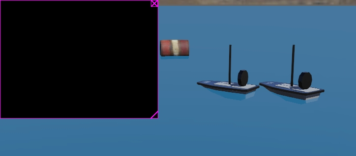

# fleet-dt

A C implementation of Fleet-DT, the digital twin model and architecture of

> A. R. P. Domingues, C. J. D. Silva, F. da R. Lui, J. Maia, R. S. Cenço,
> C. A. M. Marcon, F. G. Moraes. **A Digital Twin Model and Architecture for
> Monitoring and Controlling Fleets of Autonomous Unmanned Surface Vehicles.**
> ICECS 2026.

The Jundiá Project operates the fleet of autonomous unmanned surface vehicles
this code models. The vessels collect environmental DNA samples from the
lagoons of southern Brazil.

This repository is the companion artefact of the paper. A reader can trace any
statement in the text to the code that carries it, compile that code, and
measure it on their own machine.

The manuscript tracked here is revision `-10`. The model is Section IV and the
equations run (1) to (6). `FDT_PAPER_REVISION` in
[`include/fleet_dt/version.h`](include/fleet_dt/version.h) records the
revision, and `make test` checks it.

## Scope

The library implements the model of Section IV and the architecture of
Section III: the state types of Table I, the bounded state queue, the
transition and decision functions, the fleet aggregate, the coordinator, the
125 ms pacer, the wire protocol, the bandwidth regulators, and the link-budget
model. The application supplies the dynamics.

The library has no external dependency. `make lib` and `make test` run on a
bare toolchain. The MQTT and WeBots adapters need an SDK, so each one sits
behind its own target and prints a notice when the SDK is absent.

    make            # library, tests, examples, benchmarks, report
    make test       # every published figure of the paper, checked
    make bench      # the measurement campaign; writes results/
    make report     # the claim map, and docs/RESULTS.md
    make syntax     # type-check the SDK adapters against stubs

    make webots     # the simulation; needs WEBOTS_HOME
    make mqtt-test  # a round trip through a real broker; needs libmosquitto

Requires `gcc`, `make`, and glibc. The pacer calls POSIX.1-2008
`clock_nanosleep` with `TIMER_ABSTIME`, which Apple libc does not provide.

## Layout

| Path | Contents |
|---|---|
| `include/fleet_dt/`, `src/` | the library: model, queue, transition, fleet, coordinator, pacer, feasibility, wire, regulators, link budget, DTE, plotter |
| `tests/` | one suite per module; each published figure is asserted rather than printed |
| `examples/` | two runnable programs, described in [`examples/README.md`](examples/README.md) |
| `tools/injector/` | the synthetic telemetry injectors of Section V-B |
| `tools/bench/` | the measurement campaign |
| `tools/report/` | the claim map and the results assembly |
| `adapters/` | Ardupilot ingest, the camera boundary, MQTT, and the WeBots project: world, hull meshes, and the controller running δ |
| `config/mosquitto/` | the bridge-mode broker configuration of Section III |
| `docs/` | the paper-to-code map, the claim map, the generated results |

## Reading the paper alongside the code

[`docs/paper-to-code.md`](docs/paper-to-code.md) maps each symbol of
Sections III, IV and V to the file that implements it. `Bᵢᵗ` resolves to
`fdt_state_t`, δᵉ to `fdt_twin_step`, and the coordinator `S` of Figure 4 to
`fdt_coord_t`. The same document states where the API takes a different shape
from the equations, and why.

[`docs/claim-map.md`](docs/claim-map.md) does the same at the level of
statements. It holds one row per claim the paper makes, quoted, with the file
that carries it. It also states the reading the code takes wherever the text
leaves a design choice open, so a decision here traces back to a line there.
`make report` walks that map and checks that each artefact it names exists.

## The simulation

`adapters/webots/` is a WeBots project. It contains the world of Section III
with its fluid node and two hulls, the mesh derived from the DTP, and the
controller that runs δ at the simulation tick.

    make webots && webots adapters/webots/worlds/jundia_fleet.wbt

`tests/test_world.c` checks the world against what the controller assumes of
it, with or without the SDK: the DEF names resolve, the meshes exist, one node
is the coordinator, and the 125 ms frame divides into whole physics steps.

A run against WeBots R2025a on 2026-08-17 stepped 674,360 frames under the
coordinator, stayed feasible throughout, reached a worst δ of 117 µs against
the 125 ms budget, and rendered `--mode=realtime` without a GL error.

## Measurements

`make report` generates [`docs/RESULTS.md`](docs/RESULTS.md) from the artefacts
in `results/`. Each benchmark writes three files: the report, the raw series,
and an SVG chart carrying the paper's figure as a dashed rule. A reader can
re-read a measurement, re-plot it, or reproduce it.

A benchmark times the machine that runs it, and Section V timed a different
machine. Each comparison therefore prints three fields: the value measured
here, the figure the paper publishes, and which of the two the line reports.

## Origin

Parts of this repository come from `lsa-pucrs/boat-digital-twin` (MIT), by
Anderson Domingues and the Jundiá project team:

- `fdt_state_t` derives from `dt-daemon/include/boat.h`;
- `examples/daemon.c` from `dt-daemon/daemon.c`;
- the WeBots world, the hull and collision meshes, the material and texture,
  and the immersion and drag coefficients from `projeto_barco/`.

That repository is private. This repository redistributes the assets above
under its licence and records the changes to the world in
[`adapters/webots/README.md`](adapters/webots/README.md). The credit stands in
place of a link a reader can follow.

## Funding

CNPq grants 460166/2025-8 and 308182/2023-5, and PUCRS/PROPESQ call 01/2026,
partially financed this work.

## License

MIT. See [LICENSE](LICENSE).
