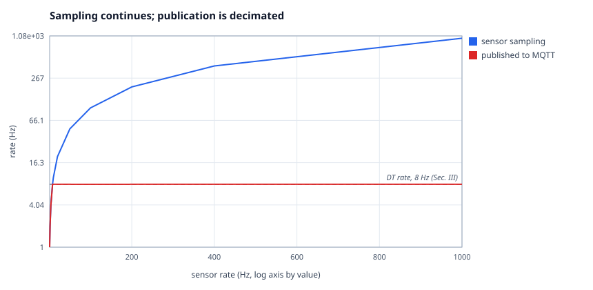
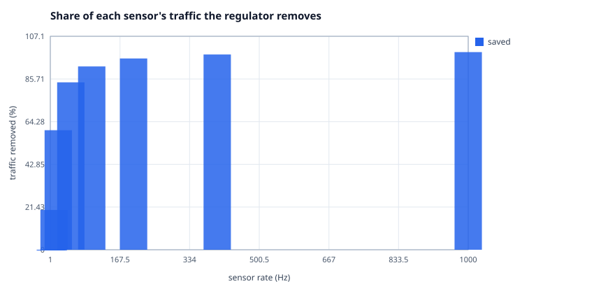
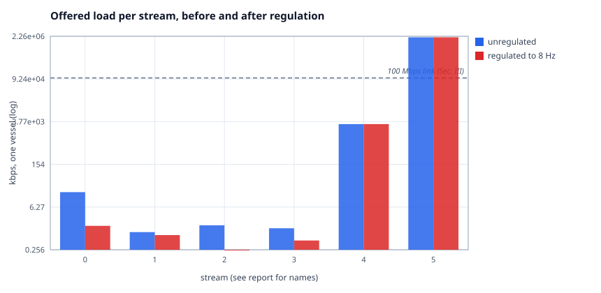
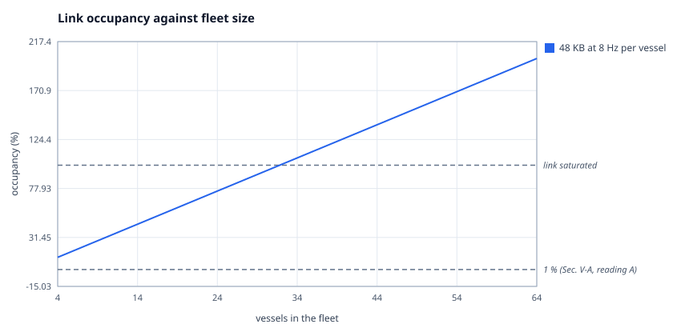
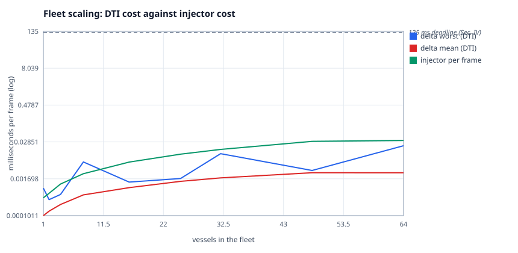
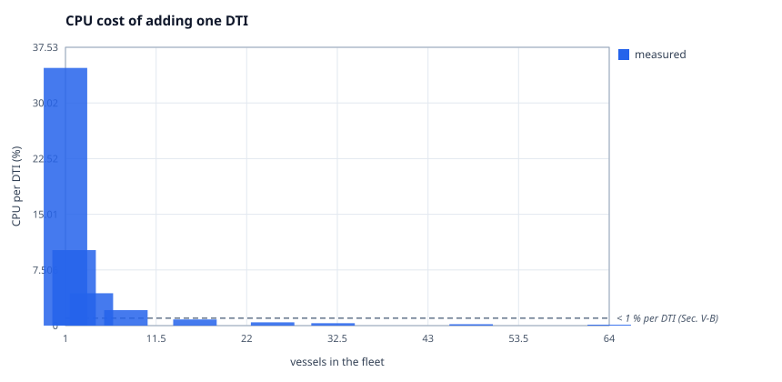
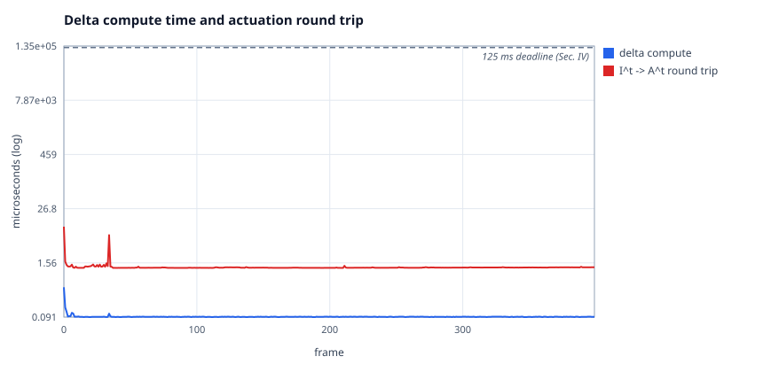
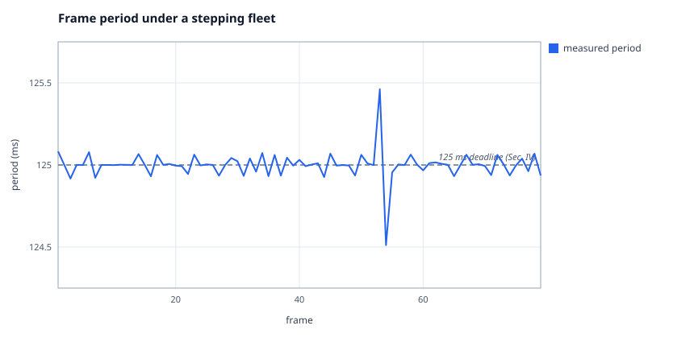
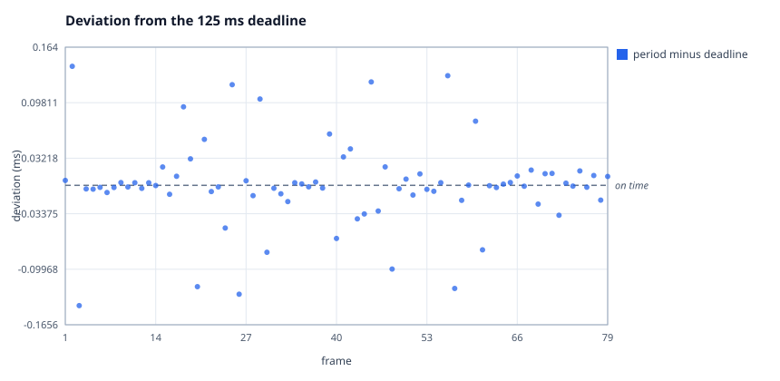

# Results

Generated by `make report` from the artefacts in `results/`, which are committed
alongside it so the charts resolve on a fresh clone. Every figure below comes
from a run on the machine that produced this file; nothing is quoted from the
paper except where a line is labelled `paper:`. Re-running `make bench` overwrites
them with your machine's numbers.

Built with fleet-dt 0.1.0 (ICECS 2026 manuscript -10).

## How to read the verdicts

- `[OK]` — the measurement agrees with the published figure.
- `[DIVERGE]` — it does not. This is reported, never fatal: a benchmark
  measures *this* machine, and this machine is not the one the paper
  measured.
- `[BOUNDARY]` — not measurable here, because the real system lives outside
  this repository.

## Claim coverage

| id | claim | § | status | artefact |
|---|---|---|---|---|
| C1 | fleet-level DT model and architecture | Abstract | quita | `roll-up of C2 through C19` |
| C2 | architecture relies on MQTT | Abstract, III | quita | `tests/it_mqtt.c` |
| C3 | integrates Ardupilot, WeBots, other simulations | Abstract | quita | `adapters/webots/worlds/jundia_fleet.wbt` |
| C4 | link-budget modelling validated | Abstract, V-A | quita | `src/linkbudget.c` |
| C5 | bandwidth regulators guaranteeing QoS | Abstract, III | quita | `src/regulator.c` |
| C6 | fleet as a DTA of per-vessel DTIs | I (i) | quita | `src/fleet.c` |
| C7 | parallel simulations in one DTE | I (ii) | quita | `src/dte.c` |
| C8 | near-real-time 3D reference | I (iii) | quita | `adapters/webots/controllers/fdt_controller/fdt_controller.c` |
| C9 | brokers in bridge mode | III | quita | `config/mosquitto/boat.conf` |
| C10 | LSDT small against 100 Mbps | III | quita | `tools/bench/bench_bandwidth.c` |
| C11 | camera feed separated from MQTT | III | quita | `adapters/rtsp/fdt_rtsp.h` |
| C12 | regulators drop in the client, sensors keep pace | III | quita | `tests/test_regulator.c` |
| C13 | 8 Hz, 125 ms hard deadline | IV | quita | `src/tick.c` |
| C14 | 48-byte state, 48d queue, 23 KB per minute | IV | quita | `tests/test_queue.c` |
| C15 | feasible only if delta fits the period | IV | quita | `src/feasibility.c` |
| C16 | non-autonomous vessel, A subset of B | IV | quita | `src/transition.c` |
| C17 | homogeneous and heterogeneous fleets | IV | quita | `tests/test_fleet.c` |
| C18 | coordinator computes c^t while distributing g^t | IV | quita | `src/coordinator.c` |
| C19 | Table I's 21 entries and their units | IV | quita | `include/fleet_dt/model.h` |
| C20 | bandwidth figure of Section V-A | V-A | quita | `results/bandwidth.txt` |
| C21 | no notable MQTT latency, no stuttering | V-A | quita | `results/jitter.txt` |
| C22 | WeBots CPU: 10 % then under 1 % | V-A | fronteira | `measurable now, not yet measured` |
| C23 | delta feasible, actuation still late | V-A | quita | `results/latency.txt` |
| C24 | state range enabling MPC-like operation | V-A | quita | `examples/daemon.c` |
| C25 | under 1 % CPU per added DTI | V-B | quita | `results/scale.txt` |
| C26 | injector-bound ceiling near 25 boats | V-B | quita | `tools/injector/injector.c` |
| C27 | partial and double frame updates | V-B | quita | `src/framesync.c` |
| C28 | Kalman for the operator, raw for actuation | V-A | quita | `examples/two_paths.c` |
| D1 | no formal input-to-delta connection | VI | diferido | `declared future work` |
| D2 | fluid and ML simulations in the model | VI | diferido | `declared future work` |
| D3 | MQTT inside the firmware | VI | diferido | `declared future work` |
| D4 | regulators as a broker QoS rule | VI | diferido | `declared future work` |
| D5 | real-time protocol under MQTT | VI | diferido | `declared future work` |
| D6 | dropping late packets at the receiver | VI | diferido | `declared future work` |
| D7 | fleet result is HILS only | V | diferido | `field campaign pending` |

**quita 27 · fronteira 1 · diferido 7 · pendente 0**

`diferido` items are the ones Section VI declares future work. Building them
would contradict the published text, so their absence is the correct state.

## Bandwidth regulators (C5, C12)





```
== fleet-dt bandwidth regulator bench ==
fleet-dt 0.1.0 (ICECS 2026 manuscript -10)
DT rate: 8 Hz   samples per sensor: 20000

--- per sensor rate ---
   sensor Hz published Hz   control Hz      saved    verdict
           1         1.00            1       0.0 %  untouched
           2         2.00            2       0.0 %  untouched
           4         4.00            4       0.0 %  untouched
           8         8.00            8       0.0 %  untouched
          10         8.00           10      20.0 %  decimated
          20         8.00           20      60.0 %  decimated
          50         8.00           50      84.0 %  decimated
         100         7.99          100      92.0 %  decimated
         200         8.00          200      96.0 %  decimated
         400         8.00          400      98.0 %  decimated
        1000         8.00         1000      99.2 %  decimated

--- the two halves of the Section III claim ---
  publication decimated      8.00 Hz from 1000 Hz   paper: drops samples in the MQTT client   [OK]
  link traffic removed       99.2 % of traffic      paper: maximizing use of shared links     [OK]
  1 Hz gyroscope             0 dropped              paper: sensors slower than the DT pass    [OK]
  The regulator sits in the publish path, never in the sensor path.
  Sampled counts every reading the sensor produced, including the
  ones the link never carried, so a control loop reading the sensor
  directly keeps its full rate. A regulator that slowed the sensor
  would buy bandwidth by degrading control, which is the opposite of
  the QoS the abstract claims.

artefacts: results/regulator.txt, results/regulator.csv, results/regulator.svg
artefacts: results/regulator_saved.svg
```

Raw series: [`results/regulator.csv`](../results/regulator.csv)

## Link budget (C4, C10, C20)





```
== fleet-dt link budget bench ==
fleet-dt 0.1.0 (ICECS 2026 manuscript -10)
link: 100 Mbps nominal (Sec. III)   DT rate: 8 Hz

--- per-stream cost, one vessel, before and after the regulators ---
  stream       payload   sensor  unregulated    regulated    saved  source
  imu              24 B    100 Hz      19.2 kbps       1.5 kbps   92.0 %  Sec. III, 8 bytes per IMU axis
  gps              12 B     10 Hz       1.0 kbps       0.8 kbps   20.0 %  Sec. II, GPS on the NAVIO2
  baro              4 B     50 Hz       1.6 kbps       0.3 kbps   84.0 %  Sec. II, 10 cm barometer
  power             8 B     20 Hz       1.3 kbps       0.5 kbps   60.0 %  Sec. II, Arduino Micro V/I
  lsdt_agg      49152 B      8 Hz    3145.7 kbps    3145.7 kbps    0.0 %  Sec. V-A, 48 KB payload
  hsdt_cam   262144000 B      1 Hz 2097152.0 kbps 2097152.0 kbps    0.0 %  Sec. III, 1080p30 ~250 MB/s  [off MQTT]

--- the two figures that share two digits ---
  Sec. V-A packet payload : 48 KB   ->    3.146 Mbps
  Sec. IV  state width    : 48 B    ->    3.072 kbps
  Ratio 1024. Unrelated quantities; a benchmark that confused them
  would report a figure three orders of magnitude out.

--- the Section V-A figure, under both readings ---
  A: absolute occupancy      3.146 % occupied       paper: increased < 1 %                    [DIVERGE]
  B: increase over baseline  0.1500 % growth        paper: increased < 1 %                    [OK]
  The manuscript does not say which it means, and the two do not
  agree. Reading A is 3.1 % of the link; reading B, against the
  camera feed Section III describes, is far under 1 %. Recorded as
  ambiguity 5 in docs/spec/paper-claims.md; nothing here asserts
  the published figure either way.

--- aggregate MQTT load, and how many vessels fit ---
  unregulated, 1 vessel :    3.169 Mbps  (3.17 % of link)
  regulated,   1 vessel :    3.149 Mbps  (3.15 % of link)
  saved by the regulators: 0.6 % of the offered load
  vessels within 50 % of the link : 15 (13 once 20 % framing overhead is charged)
  fleet the link supports    15 vessels             paper: 25-boat run was injector-bound     [OK]

artefacts: results/bandwidth.txt, results/bandwidth.csv, results/bandwidth.svg
artefacts: results/bandwidth_fleet.svg
```

Raw series: [`results/bandwidth.csv`](../results/bandwidth.csv)

## Fleet scaling (C25, C26)





```
== fleet-dt scale bench ==
fleet-dt 0.1.0 (ICECS 2026 manuscript -10)
frames per size: 200   window depth: 4   queue capacity: 8

--- per fleet size ---
   vessels   delta worst    delta mean     cpu/DTI     inj/frame   feasible
         1        2.3 us        0.2 us    21.446 %        0.7 us        yes
         2        0.6 us        0.3 us    10.038 %        1.1 us        yes
         4        1.1 us        0.5 us     4.180 %        2.3 us        yes
         8       12.5 us        1.0 us     2.011 %        5.1 us        yes
        16        3.3 us        1.9 us     0.823 %       12.1 us        yes
        25        5.4 us        3.0 us     0.448 %       23.2 us        yes
        32       16.2 us        4.0 us     0.327 %       34.1 us        yes
        48       14.0 us        5.5 us     0.186 %       55.9 us        yes
        64       13.9 us        6.2 us     0.121 %       74.0 us        yes

--- DTI side — what Section V-B calls negligible ---
  cpu per DTI                0.1209 %               paper: < 1 %                              [OK]
  worst delta, 64 vessels    13.9 us                paper: < 125 ms deadline                  [OK]
  DTI ceiling here           >= 64 vessels          paper: not the paper's 25                 [OK]

--- injector side — the ceiling Section V-B actually hit ---
  publish+step fits period   >= 64 vessels          paper: budget check, not a pace observation [OK]
  missed deadlines, 64 paced 0 of 40 frames         paper: injectors could not keep pace      [OK]
  Section V-B attributes its ceiling to the injectors, not to the
  DTIs: "hard-programming injectors to inject packets periodically
  could not keep the simulation pace for larger fleets (> 25 boats,
  same computer model)". The two ceilings are reported apart so the
  DTI is not credited with a limit it does not have. This machine
  reaches neither ceiling at 64 vessels; the paper's hardware and
  its real broker are not this loopback.

--- frame integrity under a lossy link (Section V-B) ---
  A lossless transport can never show the pathology, so the clean
  sweep above reports zeros by construction. This row injects the
  two faults Section V-B describes: a packet that never arrives, and
  a packet the network stack holds into the following frame.

  16 vessels, drop 1 in 61, defer 1 in 43, 200 frames
    partial frames : 106 of 200
    double updates : 72
    stale packets  : 0
    delta worst    : 1.4 us   feasible: yes
  pathology reproduced       106 partial, 72 double paper: some boats, not every frame        [OK]
  Stale packets stay at 0 here, and that is the deferral being
  order-preserving rather than the counter being broken: a held
  packet is delivered at the head of the next poll, so it still
  arrives before the fresher one behind it. It lands in the wrong
  frame, which makes it a double update, not an outdated read. The
  outdated-read path needs reordering, and is covered by
  tests/test_wire.c.
  Counted, never corrected. Dropping late packets at the receiver is
  item D6 of docs/spec/paper-claims.md, which Section VI declares
  future work; the DTI keeps stepping and the monitor keeps score.
  Note that delta stays feasible throughout: a degraded link starves
  the model, it does not slow it.

artefacts: results/scale.txt, results/scale.csv, results/scale.svg
artefacts: results/scale_cpu.svg
```

Raw series: [`results/scale.csv`](../results/scale.csv)

## Delta time against actuation round trip (C23)



```
== fleet-dt latency bench ==
fleet-dt 0.1.0 (ICECS 2026 manuscript -10)
transport: in-process loopback   vessels: 4   frames: 400

--- measurement 1 — delta compute time (Section IV) ---
  p50     0.49 us   p95     0.62 us   p99     0.88 us   worst     1.85 us
  delta under the deadline   1.85 us worst          paper: delta in less than 125 ms is feasible [OK]

--- measurement 2 — actuation round trip (Section V-A) ---
  I^t published -> A^t delivered
  p50     5.75 us   p95     7.38 us   p99    15.96 us   worst    40.38 us
  round trip over a network  not measured here      paper: actuation is delivered late        [BOUNDARY]
  This run uses the in-process loopback, so the round trip carries
  no network. Section V-A's observation is about a real link, and
  reproducing it needs the MQTT transport against a broker. What
  this block does establish is that the two quantities are measured
  separately: delta being feasible says nothing about when the
  actuation arrives.

--- why they are not one number ---
  delta worst    :     1.85 us  (compute)
  round trip p50 :     5.75 us  (compute + transport)
  The second contains the first. Adding them would count
  the compute twice.

artefacts: results/latency.txt, results/latency.csv, results/latency.svg
```

Raw series: [`results/latency.csv`](../results/latency.csv)

## Frame timing (C13, C21)





```
== fleet-dt frame jitter bench ==
fleet-dt 0.1.0 (ICECS 2026 manuscript -10)
vessels: 8   frames: 80   period: 125 ms   (about 10 s of wall clock)

--- frame period held under a stepping fleet ---
  mean period      :  125.001 ms
  |deviation| p50  :    0.010 ms
  |deviation| p95  :    0.126 ms
  |deviation| p99  :    0.770 ms
  |deviation| worst:    0.771 ms
  pacer overruns   :        0
  mean frame period          125.001 ms             paper: 125 ms, 8 Hz (Sec. IV)             [OK]
  deadline misses            0                      paper: delta is a hard real-time task     [OK]
  WeBots 3D stuttering       not measured here      paper: no stuttering (Sec. V-A)           [BOUNDARY]
  Stuttering is a property of the renderer, so that half of the
  Section V-A claim needs WeBots. What this run establishes is the
  precondition: the frame clock holds while 8 vessels publish,
  decode and step underneath it, so nothing upstream of the
  renderer is losing the deadline.

artefacts: results/jitter.txt, results/jitter.csv, results/jitter.svg
artefacts: results/jitter_deviation.svg
```

Raw series: [`results/jitter.csv`](../results/jitter.csv)

## Reproducing this

```
make clean && make
make report
```

The run takes about a minute, most of it the jitter benchmark, which spends
ten seconds of wall clock by construction: it is measuring a 125 ms frame
clock over eighty frames.
