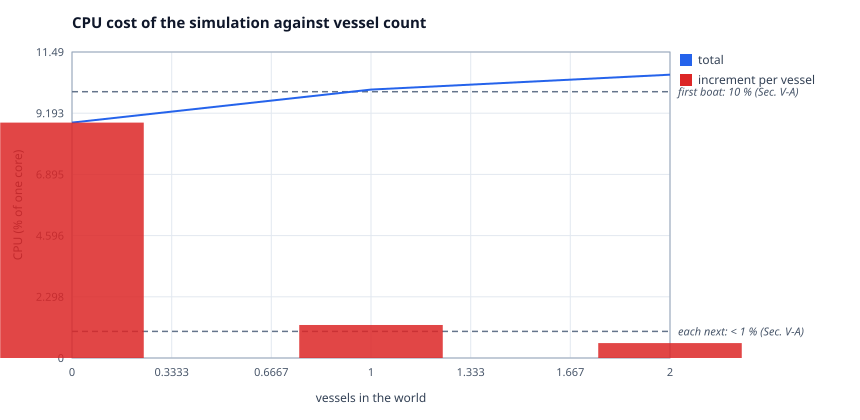

# Results

Generated by `make report` from the artefacts in `results/`, which are committed
alongside it so the charts resolve on a fresh clone. Every figure below comes
from a run on the machine that produced this file; nothing is quoted from the
paper except where a line is labelled `paper:`. Re-running `make bench` regenerates
them with your machine's numbers.

Built with fleet-dt 0.1.0 (ICECS 2026 manuscript -10).

## How to read a benchmark line

Each comparison prints what this run measured, then the figure the paper
publishes, then how the two stand together.

- `[matches paper]`: the measurement lands on the published figure.
- `[this host]`: the value belongs to the machine that ran it. A benchmark
  times the host, and Section V timed a different one.
- `[external system]`: the quantity belongs to a system this repository
  connects to rather than contains.

## Claim map

One row per statement the paper makes, and where it lives here. The long form,
with the paper's own wording, is [`docs/claim-map.md`](claim-map.md).

| id | claim | § | where it lives |
|---|---|---|---|
| C1 | fleet-level DT model and architecture | Abstract | `roll-up of C2 through C19` |
| C2 | architecture relies on MQTT | Abstract, III | `tests/it_mqtt.c` |
| C3 | integrates Ardupilot, WeBots, other simulations | Abstract | `adapters/webots/worlds/jundia_fleet.wbt` |
| C4 | link-budget modelling validated | Abstract, V-A | `src/linkbudget.c` |
| C5 | bandwidth regulators guaranteeing QoS | Abstract, III | `src/regulator.c` |
| C6 | fleet as a DTA of per-vessel DTIs | I (i) | `src/fleet.c` |
| C7 | parallel simulations in one DTE | I (ii) | `src/dte.c` |
| C8 | near-real-time 3D reference | I (iii) | `adapters/webots/controllers/fdt_controller/fdt_controller.c` |
| C9 | brokers in bridge mode | III | `config/mosquitto/boat.conf` |
| C10 | LSDT small against 100 Mbps | III | `tools/bench/bench_bandwidth.c` |
| C11 | camera feed separated from MQTT | III | `adapters/rtsp/fdt_rtsp.h` |
| C12 | regulators drop in the client, sensors keep pace | III | `tests/test_regulator.c` |
| C13 | 8 Hz, 125 ms hard deadline | IV | `src/tick.c` |
| C14 | 48-byte state, 48d queue, 23 KB per minute | IV | `tests/test_queue.c` |
| C15 | feasible only if delta fits the period | IV | `src/feasibility.c` |
| C16 | non-autonomous vessel, A subset of B | IV | `src/transition.c` |
| C17 | homogeneous and heterogeneous fleets | IV | `tests/test_fleet.c` |
| C18 | coordinator computes c^t while distributing g^t | IV | `src/coordinator.c` |
| C19 | Table I's 21 entries and their units | IV | `include/fleet_dt/model.h` |
| C20 | bandwidth figure of Section V-A | V-A | `results/bandwidth.txt` |
| C21 | no notable MQTT latency, no stuttering | V-A | `results/jitter.txt` |
| C22 | WeBots CPU: 10 % then under 1 % | V-A | `tools/bench/bench_webots_cpu.c` |
| C23 | delta feasible, actuation still late | V-A | `results/latency.txt` |
| C24 | state range enabling MPC-like operation | V-A | `examples/daemon.c` |
| C25 | under 1 % CPU per added DTI | V-B | `results/scale.txt` |
| C26 | injector-bound ceiling near 25 boats | V-B | `tools/injector/injector.c` |
| C27 | partial and double frame updates | V-B | `src/framesync.c` |
| C28 | Kalman for the operator, raw for actuation | V-A | `examples/two_paths.c` |
| D1 | no formal input-to-delta connection | VI | `Section VI names it future work` |
| D2 | fluid and ML simulations in the model | VI | `Section VI names it future work` |
| D3 | MQTT inside the firmware | VI | `Section VI names it future work` |
| D4 | regulators as a broker QoS rule | VI | `Section VI names it future work` |
| D5 | real-time protocol under MQTT | VI | `Section VI names it future work` |
| D6 | dropping late packets at the receiver | VI | `Section VI names it future work` |
| D7 | fleet result is HILS only | V | `Section V; the field campaign is the paper's next step` |

**28 claims mapped · 7 items Section VI names as future work**

The `D` rows belong to the paper's own roadmap, so they sit outside the scope
of this repository.

## Bandwidth regulators (C5, C12)


```
== fleet-dt bandwidth regulator bench ==
fleet-dt 0.1.0 (ICECS 2026 manuscript -10)
DT rate: 8 Hz   samples per sensor: 20000

--- per sensor rate ---
   sensor Hz published Hz   control Hz      saved    verdict
           1         1.00            1       0.0 %  untouched
           2         2.00            2       0.0 %  untouched
           4         4.00            4       0.0 %  untouched
           8         8.00            8       0.0 %  untouched
          10         8.00           10      20.0 %  decimated
          20         8.00           20      60.0 %  decimated
          50         8.00           50      84.0 %  decimated
         100         7.99          100      92.0 %  decimated
         200         8.00          200      96.0 %  decimated
         400         8.00          400      98.0 %  decimated
        1000         8.00         1000      99.2 %  decimated

--- the two halves of the Section III claim ---
  publication decimated      8.00 Hz from 1000 Hz   paper: drops samples in the MQTT client   [matches paper]
  link traffic removed       99.2 % of traffic      paper: maximizing use of shared links     [matches paper]
  1 Hz gyroscope             0 dropped              paper: sensors slower than the DT pass    [matches paper]
  The regulator sits in the publish path, never in the sensor path.
  Sampled counts every reading the sensor produced, including the
  ones the link never carried, so a control loop reading the sensor
  directly keeps its full rate. A regulator that slowed the sensor
  would buy bandwidth by degrading control, which is the opposite of
  the QoS the abstract claims.

artefacts: results/regulator.txt, results/regulator.csv, results/regulator.svg
artefacts: results/regulator_saved.svg
```

Raw series: [`results/regulator.csv`](../results/regulator.csv)

## Link budget (C4, C10, C20)


```
== fleet-dt link budget bench ==
fleet-dt 0.1.0 (ICECS 2026 manuscript -10)
link: 100 Mbps nominal (Sec. III)   DT rate: 8 Hz

--- per-stream cost, one vessel, before and after the regulators ---
  stream       payload   sensor  unregulated    regulated    saved  source
  imu              24 B    100 Hz      19.2 kbps       1.5 kbps   92.0 %  Sec. III, 8 bytes per IMU axis
  gps              12 B     10 Hz       1.0 kbps       0.8 kbps   20.0 %  Sec. II, GPS on the NAVIO2
  baro              4 B     50 Hz       1.6 kbps       0.3 kbps   84.0 %  Sec. II, 10 cm barometer
  power             8 B     20 Hz       1.3 kbps       0.5 kbps   60.0 %  Sec. II, Arduino Micro V/I
  lsdt_agg      49152 B      8 Hz    3145.7 kbps    3145.7 kbps    0.0 %  Sec. V-A, 48 KB payload
  hsdt_cam   262144000 B      1 Hz 2097152.0 kbps 2097152.0 kbps    0.0 %  Sec. III, 1080p30 ~250 MB/s  [off MQTT]

--- the two figures that share two digits ---
  Sec. V-A packet payload : 48 KB   ->    3.146 Mbps
  Sec. IV  state width    : 48 B    ->    3.072 kbps
  Ratio 1024. The state width of Section IV and the packet payload of
  Section V-A are separate quantities, printed on separate rows.

--- the Section V-A figure, under both readings ---
  A: absolute occupancy      3.146 % occupied       paper: increased < 1 %                    [this host]
  B: increase over baseline  0.1500 % growth        paper: increased < 1 %                    [matches paper]
  Reading A is the payload as a share of the whole link. Reading B
  is its growth over the camera feed Section III describes. Both
  are printed, and fdt_link_utilization and fdt_link_increase are
  the two symbols that compute them.

--- aggregate MQTT load, and how many vessels fit ---
  unregulated, 1 vessel :    3.169 Mbps  (3.17 % of link)
  regulated,   1 vessel :    3.149 Mbps  (3.15 % of link)
  saved by the regulators: 0.6 % of the offered load
  vessels within 50 % of the link : 15 (13 once 20 % framing overhead is charged)
  fleet the link supports    15 vessels             paper: 25-boat run was injector-bound     [matches paper]

artefacts: results/bandwidth.txt, results/bandwidth.csv, results/bandwidth.svg
artefacts: results/bandwidth_fleet.svg
```

Raw series: [`results/bandwidth.csv`](../results/bandwidth.csv)

## Fleet scaling (C25, C26)


```
== fleet-dt scale bench ==
fleet-dt 0.1.0 (ICECS 2026 manuscript -10)
frames per size: 200   window depth: 4   queue capacity: 8

--- per fleet size ---
   vessels   delta worst    delta mean     cpu/DTI     inj/frame   feasible
         1        0.4 us        0.1 us    16.680 %        0.2 us        yes
         2        0.1 us        0.1 us     9.272 %        0.3 us        yes
         4        0.2 us        0.1 us     4.083 %        0.6 us        yes
         8        1.5 us        0.2 us     1.768 %        1.4 us        yes
        16        0.5 us        0.4 us     0.743 %        3.1 us        yes
        25        1.3 us        0.5 us     0.445 %        3.7 us        yes
        32        0.8 us        0.6 us     0.334 %        5.0 us        yes
        48        1.4 us        1.0 us     0.210 %        9.0 us        yes
        64        1.8 us        1.3 us     0.128 %       14.4 us        yes

--- DTI side, what Section V-B calls negligible ---
  cpu per DTI                0.1283 %               paper: < 1 %                              [matches paper]
  worst delta, 64 vessels    1.8 us                 paper: < 125 ms deadline                  [matches paper]
  DTI ceiling here           >= 64 vessels          paper: not the paper's 25                 [matches paper]

--- injector side, the ceiling Section V-B reached ---
  publish+step fits period   >= 64 vessels          paper: budget check, not a pace observation [matches paper]
  missed deadlines, 64 paced 0 of 40 frames         paper: injectors could not keep pace      [matches paper]
  Section V-B attributes its ceiling to the injectors, not to the
  DTIs: "hard-programming injectors to inject packets periodically
  could not keep the simulation pace for larger fleets (> 25 boats,
  same computer model)". The two ceilings are therefore reported
  apart, each against its own subject. This machine reaches neither
  at 64 vessels, over a loopback rather than the paper's hardware
  and its real broker.

--- frame integrity under a lossy link (Section V-B) ---
  A lossless transport shows neither update pattern, so the clean
  sweep above reports zeros by construction. This row injects the
  two link conditions Section V-B describes: a packet that never
  arrives, and a packet the network stack holds into the following
  frame.

  16 vessels, drop 1 in 61, defer 1 in 43, 200 frames
    partial frames : 106 of 200
    double updates : 72
    stale packets  : 0
    delta worst    : 0.9 us   feasible: yes
  partial and double updates 106 partial, 72 double paper: some boats, not every frame        [matches paper]
  Stale packets stay at 0 here, because the deferral preserves
  order: a held packet is delivered at the head of the next poll,
  so it still arrives before the fresher one behind it. It lands in
  a later frame, which counts as a double update rather than an
  outdated read. The outdated-read path needs reordering and is
  covered by tests/test_wire.c.
  Counted, never corrected. Dropping late packets at the receiver is
  item D6 of docs/claim-map.md, which Section VI names as
  future work; the DTI keeps stepping and the monitor keeps score.
  Note that delta stays feasible throughout: a degraded link starves
  the model, it does not slow it.

artefacts: results/scale.txt, results/scale.csv, results/scale.svg
artefacts: results/scale_cpu.svg
```

Raw series: [`results/scale.csv`](../results/scale.csv)

## Delta time against actuation round trip (C23)


```
== fleet-dt latency bench ==
fleet-dt 0.1.0 (ICECS 2026 manuscript -10)
transport: in-process loopback   vessels: 4   frames: 400

--- measurement 1, delta compute time (Section IV) ---
  p50     0.09 us   p95     0.09 us   p99     0.11 us   worst     0.43 us
  delta under the deadline   0.43 us worst          paper: delta in less than 125 ms is feasible [matches paper]

--- measurement 2, actuation round trip (Section V-A) ---
  I^t published -> A^t delivered
  p50     1.21 us   p95     1.29 us   p99     1.44 us   worst    10.42 us
  round trip over a network  not measured here      paper: actuation is delivered late        [external system]
  This run uses the in-process loopback, so the round trip carries
  no network. Section V-A's observation is about a real link, and
  reproducing it needs the MQTT transport against a broker. What
  this block does establish is that the two quantities are measured
  separately: delta being feasible says nothing about when the
  actuation arrives.

--- why they are not one number ---
  delta worst    :     0.43 us  (compute)
  round trip p50 :     1.21 us  (compute + transport)
  The second contains the first. Adding them would count
  the compute twice.

artefacts: results/latency.txt, results/latency.csv, results/latency.svg
```

Raw series: [`results/latency.csv`](../results/latency.csv)

## Frame timing (C13, C21)


```
== fleet-dt frame jitter bench ==
fleet-dt 0.1.0 (ICECS 2026 manuscript -10)
vessels: 8   frames: 80   period: 125 ms   (about 10 s of wall clock)

--- frame period held under a stepping fleet ---
  mean period      :  125.000 ms
  |deviation| p50  :    0.016 ms
  |deviation| p95  :    0.078 ms
  |deviation| p99  :    0.461 ms
  |deviation| worst:    0.488 ms
  pacer overruns   :        0
  mean frame period          125.000 ms             paper: 125 ms, 8 Hz (Sec. IV)             [matches paper]
  deadline misses            0                      paper: delta is a hard real-time task     [matches paper]
  WeBots 3D stuttering       not measured here      paper: no stuttering (Sec. V-A)           [external system]
  Stuttering is a property of the renderer, so that half of the
  Section V-A claim needs WeBots. What this run establishes is the
  precondition: the frame clock holds while 8 vessels publish,
  decode and step underneath it, so nothing upstream of the
  renderer is losing the deadline.

artefacts: results/jitter.txt, results/jitter.csv, results/jitter.svg
artefacts: results/jitter_deviation.svg
```

Raw series: [`results/jitter.csv`](../results/jitter.csv)

## CPU cost per vessel in the simulation (C22)



```
```

Raw series: [`results/webots_cpu.csv`](../results/webots_cpu.csv)

## Reproducing this

```
make clean && make
make report
```

The run takes about a minute, most of it the jitter benchmark, which spends
ten seconds of wall clock by construction: it is measuring a 125 ms frame
clock over eighty frames.
